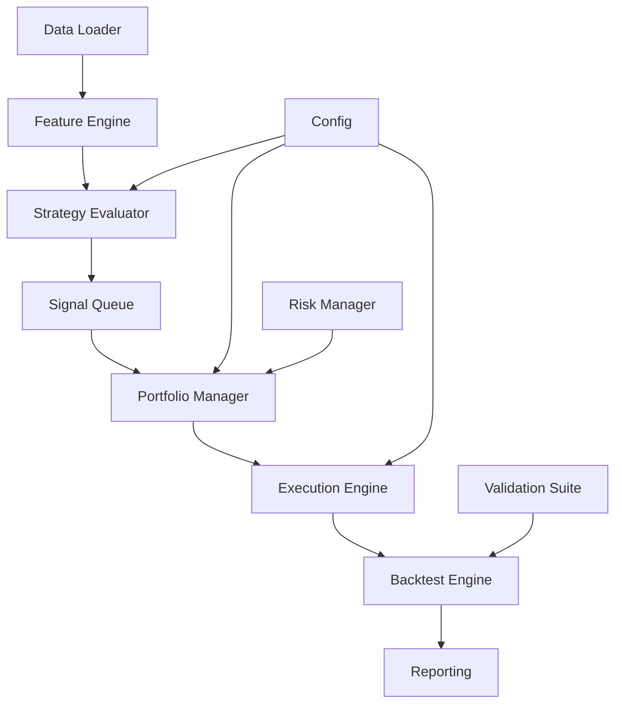

# Trading System V0.1

[](https://www.python.org/downloads/)
[](LICENSE)
[](./htmlcov/index.html)

> **Note**: Test coverage badge shows current coverage. Generate coverage report with `./scripts/coverage_report.sh` or `pytest --cov=trading_system --cov-report=html`. View detailed coverage in `htmlcov/index.html`.

A config-driven daily momentum trading system for equities and cryptocurrency with walk-forward backtesting, realistic execution costs, and comprehensive validation suite.

## Overview

This trading system implements a systematic momentum strategy that:
- Generates signals at daily close (D)
- Executes trades at next day open (D+1)
- Supports both equity and cryptocurrency markets
- Uses walk-forward backtesting with train/validation/holdout splits
- Includes realistic execution costs (fees + slippage)
- Provides robust validation through statistical tests and stress scenarios

## Key Features

### 🎯 Strategy Components
- **Equity Momentum Strategy**: Breakout-based entries with MA trend filters
- **Crypto Momentum Strategy**: Similar logic with crypto-specific parameters
- **Signal Generation**: 20D and 55D breakout triggers with configurable clearances
- **Exit Management**: MA cross exits, ATR-based stop losses, staged exits (crypto)
- **Position Sizing**: Risk-based sizing (0.75% risk per trade)
- **Portfolio Management**: Correlation guards, volatility scaling, capacity constraints

### 📊 Data & Indicators
- **OHLCV Data Loading**: CSV-based with validation
- **Technical Indicators**: MA (20/50/200), ATR14, ROC60, breakout levels, ADV20
- **Feature Computation**: Automated indicator calculation pipeline
- **Data Validation**: OHLCV relationship checks, missing data handling

### 🔄 Backtesting Engine
- **Event-Driven Loop**: Daily event processing with no lookahead bias
- **Walk-Forward Splits**: Train/validation/holdout period management
- **Realistic Execution**: Slippage models, fee calculation, capacity constraints
- **Portfolio Tracking**: Equity curve, positions, cash, exposure monitoring

### ✅ Validation Suite
- **Statistical Tests**: Bootstrap analysis, permutation tests
- **Stress Tests**: Slippage stress, bear market, range market, flash crash scenarios
- **Sensitivity Analysis**: Parameter grid search
- **Correlation Analysis**: Portfolio diversification monitoring

### 📈 Reporting & Metrics
- **CSV Outputs**: Equity curve, trade log, weekly summaries
- **JSON Reports**: Monthly performance reports with metrics
- **Performance Metrics**: Sharpe ratio, Calmar ratio, max drawdown, R-multiples, profit factor
- **Benchmark Comparison**: Relative performance vs SPY/BTC

## Installation

### Docker Installation (Recommended) ⭐

**Docker is the recommended installation method** as it provides a consistent environment across all systems, avoids environment-specific issues (like NumPy segfaults on macOS), and ensures reproducible results.

#### Prerequisites
- Docker Desktop installed ([Download here](https://www.docker.com/products/docker-desktop/))
  - **macOS/Windows**: Docker Desktop includes Docker Compose
  - **Linux**: Install Docker and Docker Compose separately
- Docker Compose 2.0+ (included with Docker Desktop)

#### Quick Start with Docker

```bash
# 1. Clone or navigate to the repository
cd trade-test

# 2. Build the Docker image
make docker-build

# 3. Verify installation by running unit tests
make docker-test-unit
```

See [DOCKER_SETUP.md](DOCKER_SETUP.md) for detailed instructions.

#### Docker Compose Examples

```bash
# Run backtest
docker-compose run --rm trading-system backtest \
  --config /app/configs/run_config.yaml --period train

# Run validation suite
docker-compose run --rm trading-system validate \
  --config /app/configs/run_config.yaml

# Run tests (unit, integration, validation)
make docker-test-unit
make docker-test-integration
make docker-test-validation

# Interactive shell
docker-compose run --rm trading-system /bin/bash
```

#### Volume Mounts

The `docker-compose.yml` includes pre-configured volume mounts:
- `./data` → `/app/data` (read-only) - Input data files
- `./EXAMPLE_CONFIGS` → `/app/configs` (read-only) - Configuration files
- `./results` → `/app/results` (read-write) - Output results
- `./tests/fixtures` → `/app/tests/fixtures` (read-only) - Test data
- `./configs` → `/app/custom_configs` (read-only) - Custom configs (optional)

Ensure your data files and configs are in the correct directories on your host machine before running Docker commands.

---

### Native Python Installation (Alternative)

If you prefer not to use Docker, you can install the system natively. However, this may lead to environment-specific issues, especially on macOS.

#### Prerequisites
- Python 3.9+ (3.11+ recommended)
- pip or conda package manager

#### Install Dependencies

**Option A: Master Setup Script (Recommended)**

```bash
# Clone or navigate to the repository
cd trade-test

# Run master setup script (one command does everything)
./setup.sh

# This will:
# - Check and set up Python environment
# - Install all dependencies (production + dev)
# - Install pre-commit git hooks
# - Verify installation
```

**Option B: Automated Setup (Alternative)**

```bash
# Run automated environment setup script
./scripts/setup_environment.sh

# Then install pre-commit hooks separately
./scripts/setup_precommit_hooks.sh
```

**Option C: Manual Installation**

```bash
# Clone or navigate to the repository
cd trade-test

# Install required packages
pip install --upgrade pip
pip install -e ".[dev]"

# Or using requirements files
pip install -r requirements.txt
pip install -r requirements-dev.txt
```

**macOS Users**: If you encounter NumPy segmentation faults, see [ENVIRONMENT_ISSUE.md](ENVIRONMENT_ISSUE.md). **Docker is strongly recommended for macOS.**

#### Verify Installation

If you used the master setup script (`./setup.sh`), verification is already included. Otherwise:

```bash
# Quick verification
./quick_test.sh

# Or run environment check
./scripts/setup_environment.sh --check

# Or manually check
python -c "import pandas, numpy, pydantic, yaml; print('Dependencies OK')"
```

### Environment Variables

**Current Status**: No environment variables are required for backtesting functionality.

The trading system is designed to work entirely through configuration files. All settings, data paths, and strategy parameters are specified in YAML configuration files.

#### Docker Environment Variables

When running with Docker (via `docker-compose.yml`), the following environment variables are automatically set:

- **`PYTHONPATH=/app`**: Ensures Python can find the `trading_system` module
- **`PYTHONUNBUFFERED=1`**: Ensures Python output is not buffered (useful for logging)

These are set automatically in `docker-compose.yml` and do not need to be configured manually.

#### Future API Adapter Support

If you plan to use broker API adapters (e.g., Alpaca, Interactive Brokers) for live trading or paper trading:

- **API credentials** are currently passed via `AdapterConfig` objects in code
- **No environment variables** are currently used for API keys
- Credentials should be stored securely and passed programmatically

**Note**: The system does not currently load credentials from environment variables. If you need this functionality, you would need to:
1. Use a library like `python-dotenv` to load from `.env` files
2. Modify adapter initialization to read from `os.getenv()`
3. Ensure `.env` files are in `.gitignore` (already configured ✅)

For backtesting, no API credentials are needed as the system uses local CSV/Parquet data files.

## Market Data

### Getting Started with Data

The trading system requires OHLCV (Open, High, Low, Close, Volume) market data in CSV format. We recommend a phased approach:

#### Phase 1: Free Data for Development & Testing

Start with **Alpha Vantage** (free tier) to validate your setup and refine your strategy:

```bash
# 1. Get a free API key at https://www.alphavantage.co/support/#api-key

# 2. Add to your .env file
echo "ALPHA_VANTAGE_API_KEY=your_key_here" >> .env

# 3. Download sample data (uses 6 API calls)
python scripts/download_data.py --preset small
```

**Free tier limits**: 25 API calls/day, 5 calls/minute. This is sufficient for:
- Downloading 5-10 symbols for initial testing
- Validating your backtest configuration
- Developing and refining your strategy

#### Phase 2: Production Data

Once you've validated your strategy and are ready for production-scale backtesting, upgrade to a paid data source:

| Source | Coverage | Price | Best For |
|--------|----------|-------|----------|
| **Massive** | US equities, crypto | $29-199/mo | Production backtesting, real-time data |
| **Tiingo** | US equities, crypto | $10-30/mo | Cost-effective historical data |
| **EOD Historical** | Global equities | $20-80/mo | International markets |

The system has built-in support for Massive (formerly Polygon.io):

```bash
# Add Massive API key to .env
echo "MASSIVE_API_KEY=your_key_here" >> .env

# Download data using Massive (faster, no rate limits)
python scripts/download_data.py --source massive --preset large
```

### Data Directory Structure

After downloading, your data should be organized as:

```
data/
├── equity/
│   ├── daily/           # OHLCV CSV files (AAPL.csv, MSFT.csv, etc.)
│   └── universe/        # Universe files (small.csv, custom.csv)
├── crypto/
│   └── daily/           # Crypto OHLCV files (BTC.csv, ETH.csv)
└── benchmarks/          # Benchmark data (SPY.csv)
```

### Download Script Options

```bash
# Download small universe (5 symbols + SPY benchmark)
python scripts/download_data.py --preset small

# Download specific symbols
python scripts/download_data.py --symbols AAPL MSFT GOOGL AMZN

# Download crypto data
python scripts/download_data.py --preset crypto

# Download compact data (100 days, faster for testing)
python scripts/download_data.py --preset small --compact

# Download benchmark only
python scripts/download_data.py --benchmark
```

## Quick Start

### 1. Run Tests (Docker Recommended)

The easiest way to run tests is using Docker with the Makefile:

```bash
# Run unit tests only
make docker-test-unit

# Run integration tests only
make docker-test-integration

# Run validation suite
make docker-test-validation

# Run all tests (unit + integration)
make docker-test-all
```

**Alternative: Native Installation**

If you installed natively (not recommended), use:

```bash
# Run unit tests only
make test-unit

# Run integration tests only
make test-integration

# Run validation suite
make test-validation

# Run all tests (unit + integration)
make test-all
```

### 2. Run a Backtest (Docker Recommended)

```bash
# Using Docker with test configuration
docker-compose run --rm trading-system backtest \
    --config /app/tests/fixtures/configs/run_test_config.yaml \
    --period train
```

Results will be saved to `tests/results/{run_id}/train/` on your host machine.

**Alternative: Native Installation**

```bash
# Using test configuration
python -m trading_system backtest \
    --config tests/fixtures/configs/run_test_config.yaml \
    --period train
```

### 3. Run Validation Suite (Docker Recommended)

```bash
# Using Docker
make docker-test-validation

# Or directly via Docker CLI
docker-compose run --rm trading-system validate \
    --config /app/tests/fixtures/configs/run_test_config.yaml
```

**Alternative: Native Installation**

```bash
# Using Makefile
make test-validation

# Or directly via CLI
python -m trading_system validate \
    --config tests/fixtures/configs/run_test_config.yaml
```

## Usage

### CLI Commands

**Using Docker (Recommended):**

```bash
# Run backtest
docker-compose run --rm trading-system backtest --config /app/<config_path> [--period train|validation|holdout]

# Run validation suite
docker-compose run --rm trading-system validate --config /app/<config_path>

# Run holdout evaluation
docker-compose run --rm trading-system holdout --config /app/<config_path>

# Generate report (future)
docker-compose run --rm trading-system report --run-id <run_id>
```

**Using Native Installation:**

```bash
# Run backtest
python -m trading_system backtest --config <config_path> [--period train|validation|holdout]

# Run validation suite
python -m trading_system validate --config <config_path>

# Run holdout evaluation
python -m trading_system holdout --config <config_path>

# Generate report (future)
python -m trading_system report --run-id <run_id>
```

**Note:** When using Docker, config paths should be relative to `/app/` (e.g., `/app/configs/run_config.yaml` or `/app/tests/fixtures/configs/run_test_config.yaml`).

### Configuration Files

The system uses YAML configuration files:

- **Strategy Configs** (`equity_config.yaml`, `crypto_config.yaml`): Define strategy parameters
- **Run Config** (`run_config.yaml`): Define backtest run parameters, data paths, splits

Example configurations are in:
- `EXAMPLE_CONFIGS/` - Production-ready examples
- `tests/fixtures/configs/` - Test configurations

### Programmatic Usage

**Using Docker (Interactive Shell):**

```bash
# Start an interactive shell in Docker
docker-compose run --rm trading-system /bin/bash

# Then run Python code inside the container
python -c "from trading_system.integration.runner import run_backtest; ..."
```

**Using Native Installation:**

```python
from trading_system.integration.runner import run_backtest, run_validation
from trading_system.configs.run_config import RunConfig

# Load configuration
config = RunConfig.from_yaml("path/to/run_config.yaml")

# Run backtest
results = run_backtest("path/to/run_config.yaml", period="train")

# Run validation
validation_results = run_validation("path/to/run_config.yaml")
```

## Project Structure

```
trade-test/
├── trading_system/          # Main package
│   ├── backtest/            # Backtest engine and event loop
│   ├── configs/             # Configuration models (Pydantic)
│   ├── data/                # Data loading and validation
│   ├── execution/           # Order execution, fills, slippage, fees
│   ├── indicators/          # Technical indicators (MA, ATR, momentum, etc.)
│   ├── integration/         # Integration runner
│   ├── models/              # Data models (Bar, Signal, Order, Position, etc.)
│   ├── portfolio/           # Portfolio management and risk
│   ├── reporting/           # CSV/JSON output and metrics
│   ├── strategies/          # Strategy implementations (equity, crypto)
│   ├── validation/          # Validation suite (bootstrap, permutation, stress)
│   └── cli.py               # Command-line interface
│
├── tests/                   # Test suite
│   ├── fixtures/           # Test data and configurations
│   ├── integration/        # Integration tests
│   └── utils/              # Test utilities and helpers
│
├── EXAMPLE_CONFIGS/         # Example configuration files
├── agent-files/            # Architecture and design documentation
│
├── requirements.txt        # Python dependencies
├── TESTING_GUIDE.md        # Comprehensive testing guide
├── QUICK_START_TESTING.md  # Quick testing reference
└── README.md               # This file
```

## Strategy Details

### Equity Strategy
- **Trend Filter**: Close > MA50, MA50 slope > 0.5% over 20 days
- **Entry**: 20D breakout (0.5% clearance) OR 55D breakout (1.0% clearance)
- **Exit**: MA20 cross below OR hard stop (2.5x ATR14)
- **Risk**: 0.75% of equity per trade
- **Capacity**: 0.5% of 20D average dollar volume

### Crypto Strategy
- **Trend Filter**: Close > MA200 (strict requirement)
- **Entry**: Same breakout triggers as equity
- **Exit**: Staged exit (MA20 warning → tighten stop → MA50 exit)
- **Stop**: 3.0x ATR14 (tightens to 2.0x after MA20 break)
- **Capacity**: 0.25% of 20D average dollar volume (stricter)

## Testing

### Quick Test
```bash
./quick_test.sh
```

### Unit Tests
```bash
pytest tests/ -v
```

### Integration Tests
```bash
pytest tests/integration/ -v
```

### Test Coverage

Generate a test coverage report:

```bash
# Using the helper script (recommended)
./scripts/coverage_report.sh

# Or manually
pytest --cov=trading_system --cov-report=html --cov-report=term-missing
```

Coverage reports:
- **HTML Report**: `htmlcov/index.html` - Interactive coverage browser
- **Terminal Report**: Shows coverage summary and missing lines
- **Target**: >90% coverage (Current: ~37.71%)

**Coverage Badge**: The README badge shows current coverage. To update the badge URL with dynamic coverage:
1. Run coverage report: `./scripts/coverage_report.sh`
2. Check coverage percentage in terminal output
3. Update badge URL in README if using a coverage service, or use static badge shown above

### Test Data
Test fixtures include 3 months of sample data (Oct-Dec 2023) for:
- **Equity**: AAPL, MSFT, GOOGL
- **Crypto**: BTC, ETH, SOL
- **Benchmarks**: SPY, BTC

See `tests/fixtures/README.md` for details.

For comprehensive testing instructions, see [TESTING_GUIDE.md](TESTING_GUIDE.md).

## Output Files

After running a backtest, results are saved to `{output_dir}/{period}/`:

- **equity_curve.csv**: Daily portfolio equity, cash, positions, exposure
- **trade_log.csv**: All executed trades with entry/exit details
- **weekly_summary.csv**: Weekly performance summaries
- **monthly_report.json**: Monthly metrics and statistics
- **backtest.log**: Execution log file

## Key Design Principles

### No Lookahead Bias
- Indicators at date `t` only use data ≤ `t`
- Signals generated at close, executed at next open
- Strict temporal ordering enforced

### Realistic Execution
- Slippage models based on ADV and volatility
- Fee calculation (1 bps per side for equity)
- Capacity constraints (order size vs ADV)
- Stress slippage during market stress

### Deterministic Results
- All randomness uses seeded RNG
- Reproducible backtests
- Configurable random seed

### Config-Driven
- Strategy parameters in YAML files
- No hardcoded values
- Easy parameter tuning and testing

## Documentation

Comprehensive documentation is organized across multiple locations:

### Quick Start
- **[Getting Started Guide](docs/user_guide/getting_started.md)** - Installation and first backtest
- **[Documentation Index](DOCUMENTATION.md)** - Complete documentation navigation

### User Documentation
- **[User Guide](docs/user_guide/README.md)** - User-facing guides and tutorials
- **[Example Configurations](EXAMPLE_CONFIGS/README.md)** - Working configuration examples

### Technical Documentation
- **[Architecture Overview](agent-files/01_ARCHITECTURE_OVERVIEW.md)** - System design and module responsibilities
- **[Configuration Guide](agent-files/02_CONFIGS_AND_PARAMETERS.md)** - Parameter documentation
- **[Data Pipeline](agent-files/03_DATA_PIPELINE_AND_VALIDATION.md)** - Data loading and validation
- **[Indicators Library](agent-files/04_INDICATORS_LIBRARY.md)** - Technical indicator specifications
- **[Strategy Details](agent-files/06_STRATEGY_EQUITY.md)** - Equity and crypto strategy logic
- **[Backtest Engine](agent-files/10_BACKTEST_ENGINE.md)** - Event loop and execution flow
- **[Validation Suite](agent-files/12_VALIDATION_SUITE.md)** - Statistical and stress testing
- **[Portfolio State Machine](agent-files/PORTFOLIO_STATE_MACHINE.md)** - Portfolio update sequence

### Developer Documentation
- **[Developer Guide](docs/developer_guide/README.md)** - Development setup and guidelines
- **[API Reference](docs/api/index.rst)** - Complete API documentation (Sphinx)

### Testing
- **[Testing Guide](TESTING_GUIDE.md)** - Comprehensive testing instructions
- **[Quick Start Testing](QUICK_START_TESTING.md)** - Quick testing reference

See [DOCUMENTATION.md](DOCUMENTATION.md) for the complete documentation index.

## Performance Benchmarks

The trading system includes comprehensive performance benchmarks for monitoring and optimization. See [Performance Characteristics](docs/PERFORMANCE_CHARACTERISTICS.md) for detailed benchmarks.

### Quick Performance Overview

| Operation | Expected Time | Configuration |
|-----------|--------------|---------------|
| Full Backtest | < 5 min | 100 symbols, 5 years, single strategy |
| Indicator Computation | < 50ms | Full feature set per symbol |
| Portfolio Update | < 5ms | 50 positions |
| Validation Suite | < 5 min | 1000 trades, full statistical tests |

### Running Benchmarks

```bash
# Run all performance benchmarks
pytest tests/performance/ -m performance --benchmark-only

# Compare against baseline (regression detection)
pytest tests/performance/ -m performance --benchmark-only --benchmark-compare
```

For production-scale benchmarks, see [Performance Characteristics](docs/PERFORMANCE_CHARACTERISTICS.md).

## Architecture

The trading system follows a modular, event-driven architecture:



### Key Components

- **Data Pipeline**: CSV loading with validation and preprocessing
- **Feature Engine**: Technical indicator computation (MA, ATR, ROC, breakouts)
- **Strategy Evaluator**: Generates signals based on strategy rules
- **Signal Queue**: Ranks and selects signals with correlation guards
- **Portfolio Manager**: Position tracking, risk limits, exposure management
- **Execution Engine**: Realistic fills with slippage and fees
- **Backtest Engine**: Event-driven loop with walk-forward splits
- **Reporting**: CSV/JSON outputs with comprehensive metrics

For detailed architecture documentation, see [Architecture Overview](agent-files/01_ARCHITECTURE_OVERVIEW.md).

## Status

**Version**: 0.0.2

This is the initial implementation (V0.1) with:
- ✅ Core backtest engine
- ✅ Equity and crypto strategies
- ✅ Data pipeline and validation
- ✅ Execution simulation
- ✅ Portfolio management
- ✅ Validation suite
- ✅ CLI interface
- ✅ Comprehensive test suite

### Future Enhancements
- Paper trading adapters
- Additional strategy types
- Real-time data integration
- Enhanced reporting and visualization

## n8n Integration

The trading system can be integrated with [n8n](https://n8n.io/) for workflow automation, scheduled backtests, and database storage. This provides:

- Visual workflow management
- Scheduled automated backtests
- Database storage (PostgreSQL)
- Slack/email alerts
- Multi-stage pipelines

### Quick Start with n8n

```bash
# Start the full stack (n8n + API + PostgreSQL)
docker-compose -f docker-compose.n8n.yml up -d

# Access services:
# - n8n:          http://localhost:5678  (admin / changeme)
# - Trading API:  http://localhost:8000/docs
# - PostgreSQL:   localhost:5432
```

See **[n8n Integration Guide](docs/N8N_INTEGRATION.md)** for complete documentation.

## Contributing

This is a V0.1 implementation. For questions or issues:
1. Review the documentation in `agent-files/`
2. Check `TESTING_GUIDE.md` for testing procedures
3. Review test fixtures and examples

## License

[Add your license information here]

## Acknowledgments

Built with:
- Python 3.9+
- pandas & numpy for data processing
- pydantic for configuration validation
- pytest for testing

---

For detailed testing instructions, see [TESTING_GUIDE.md](TESTING_GUIDE.md)
For quick testing reference, see [QUICK_START_TESTING.md](QUICK_START_TESTING.md)
